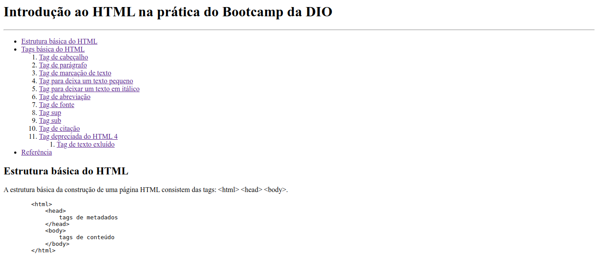
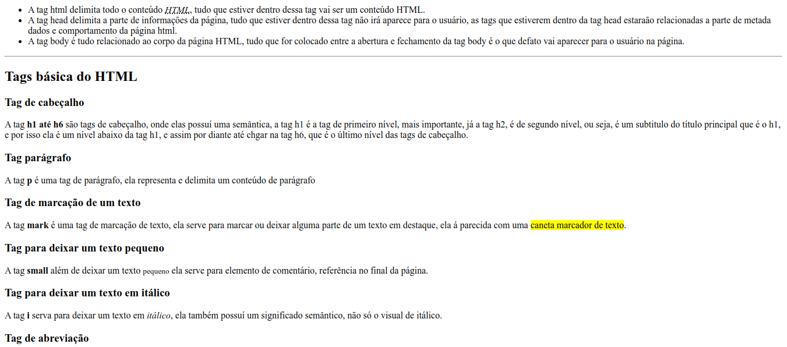
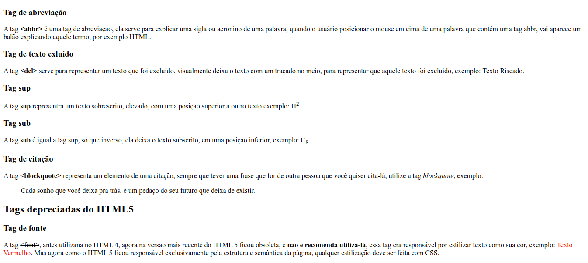
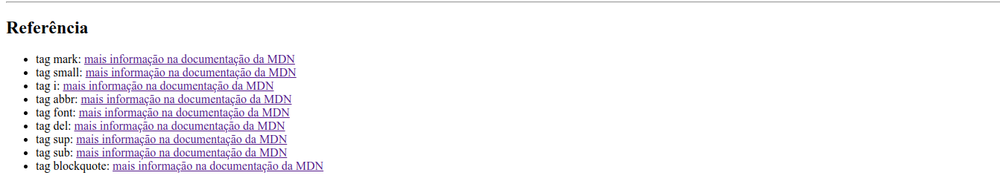

# Introdução ao HTML na prática do Bootcamp da DIO
>   A ideia deste Desafio de Projeto é elaborar um website, utilizando uma estrutura bem básica, utilizando tags aprendidas durante as aulas práticas:

-   Utilizar todas as tags explicadas nas aulas: `<h1> até <h6>, 
, <mark>, <small>, <i>, <u>, <strong>, <ol>, <ul>, <li>, <a>, 
, , , <blockquote>;`

- Utilizar novas tags sugeridas: `, <del>, 
, <abbr>` (a ideia é buscar estas tags na internet, entender como ela funciona e utilizar no texto).

## Preview

